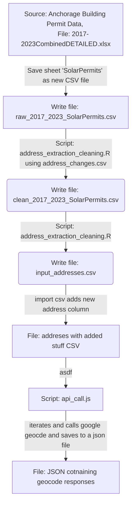

### Welcome
* This repository contains code and data regarding locations of solar installations in the Anchorage Alaska area.  
* The data represents solar installations for years 2017 through 2023. 
* The source data (Anchorage Building Permits) contained only street addresses, which made mapping difficult. Google Geocode API was called to convert these addresses to lat/long coordinates. 

### Workflow

